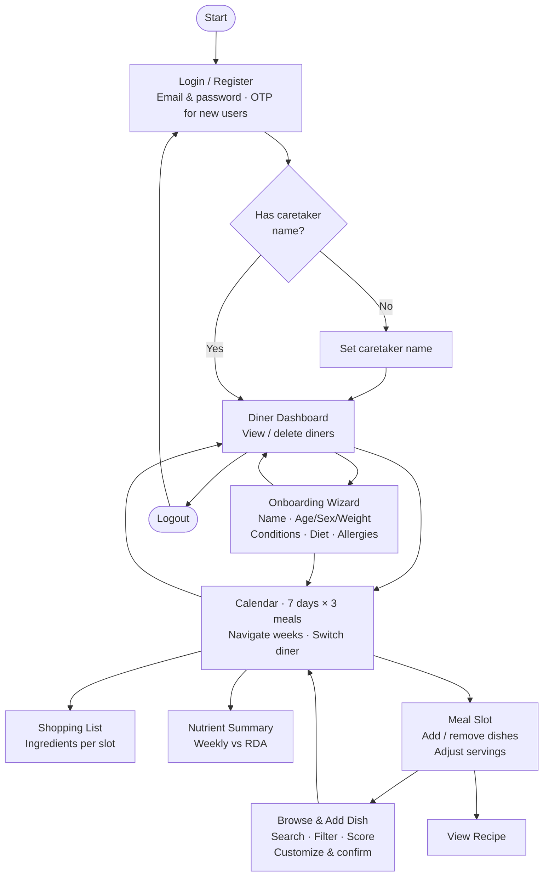

# MealWise User Flow

```mermaid
flowchart TD
    A([Start]) --> B["Login / Register<br>Email & password · OTP for new users"]
    B --> C{Has caretaker<br>name?}
    C -- No --> T["Set caretaker name"] --> D
    C -- Yes --> D["Diner Dashboard<br>View / delete diners"]

    D --> H["Onboarding Wizard<br>Name · Age/Sex/Weight<br>Conditions · Diet · Allergies"]
    D --> I["Calendar · 7 days × 3 meals<br>Navigate weeks · Switch diner"]
    D --> G([Logout]) --> B
    H --> D & I

    I --> D
    I --> L["Shopping List<br>Ingredients per slot"]
    I --> M["Nutrient Summary<br>Weekly vs RDA"]
    I --> K["Meal Slot<br>Add / remove dishes<br>Adjust servings"]

    K --> N["Browse & Add Dish<br>Search · Filter · Score<br>Customize & confirm"]
    K --> Q["View Recipe"]
    N --> I
```
