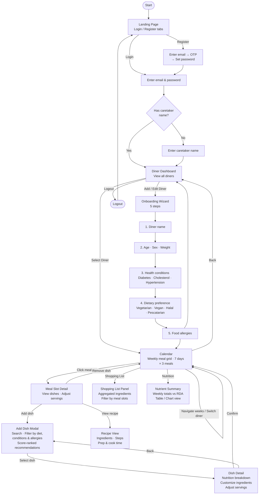

# MealWise User Flow (Full Page)

```mermaid
flowchart TD
    A([Start]) --> B["Landing Page<br>Login / Register tabs"]

    B -- Login --> C["Enter email & password"]
    B -- Register --> R["Enter email → OTP<br>→ Set password"]
    R --> C

    C --> S{Has caretaker<br>name?}
    S -- No --> T["Enter caretaker name"]
    S -- Yes --> D
    T --> D

    D["Diner Dashboard<br>View all diners"]
    D -- Add / Edit Diner --> H
    D -- Select Diner --> I
    D -- Logout --> G([Logout]) --> B

    H["Onboarding Wizard<br>5 steps"]
    H --> H1["1. Diner name"]
    H1 --> H2["2. Age · Sex · Weight"]
    H2 --> H3["3. Health conditions<br>Diabetes · Cholesterol · Hypertension"]
    H3 --> H4["4. Dietary preference<br>Vegetarian · Vegan · Halal · Pescatarian"]
    H4 --> H5["5. Food allergies"]
    H5 --> D & I

    I["Calendar<br>Weekly meal grid · 7 days × 3 meals"]
    I -- Back --> D
    I -- Navigate weeks / Switch diner --> I
    I -- Click meal slot --> K["Meal Slot Detail<br>View dishes · Adjust servings"]

    I -- Shopping List --> L["Shopping List Panel<br>Aggregated ingredients<br>Filter by meal slots"]
    I -- Nutrition --> M["Nutrient Summary<br>Weekly totals vs RDA<br>Table / Chart view"]

    K -- Add dish --> N["Add Dish Modal<br>Search · Filter by diet,<br>conditions & allergies<br>Score-ranked recommendations"]
    K -- Remove dish --> I
    K -- View recipe --> Q["Recipe View<br>Ingredients · Steps<br>Prep & cook time"]

    N -- Select dish --> P["Dish Detail<br>Nutrition breakdown<br>Customize ingredients<br>Adjust servings"]
    P -- Confirm --> I
    P -- Back --> N
```
